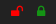

# polybar-protonvpn

Polybar-protonvpn is a custom polybar script that displays the current protonvpn connection status.  

When a connection is active, the green lock is displayed, otherwise the red lock is displayed.  


## Dependencies
This project depends on the official `protonvpn-cli`. Instructions for downloading it can be found 
<a href="https://protonvpn.com/support/official-linux-client/" target="_blank">here</a>.

[Font Awesome 5](https://fontawesome.com/changelog/latest)


## Module
```ini
[module/polybar-protonvpn]
type = custom/script
exec = ~/bin/vpncheck.sh
interval = 15
```


